# fumen谱面解析

## 前言

本文基于 knewjade 的 テト譜v115のデータ構造 （完全版） （ 方块谱面 (fumen) v115的数据构造（完全版））的ppt翻译与编写。

fumen （[fumen.zui.jp](https://fumen.zui.jp)）的正式名称为 连续方块谱面（譜面/ふめん/fumen）编辑器。是由 来自日本的方块爱好者 Mihys 制作的一款 目前在方块社区内流传最广的 **方块场地绘制应用**（方块画图软件）。

在原版的基础上，另一位日本的方块爱好者 [knewjade（点击打开推特）](https://twitter.com/1millim) 使用新的前端网页技术栈，搭配网页自适应后，建立了适用于方便手机使用的 fumen-for-mobile （[fumen 移动端适配版](https://knewjade.github.io/fumen-for-mobile/)）

同时 knewjade 将 fumen 代码的解析和生成过程做成了ppt公开，[原文链接在此](https://docs.google.com/presentation/d/1P5xt0vPGuxSb9hbRW6hvQFYKFoIccfNTJkWTdjtyigc)（谷歌文档，国内需要开启代理访问）。

本篇文章基于此ppt的内容进行翻译并附上一点自己的理解（私货？），方便给需要的同学们。

<br/>

中文版：[teatube.cn/f](https://teatube.cn/f) 和 [teatube.cn/fm](https://teatube.cn/fm) ，分别对应 原版 和 移动端。

另外：如果你在写和 fumen 相关的前端应用，使用 javascript 或 typescript 的技术栈时，
可以试着使用同样由 knewjade 制作的 npm [tetris-fumen](https://github.com/knewjade/tetris-fumen) ，使用 `npm install tetris-fumen` 也可以直接安装。

（`yarn add tetris-fumen` 也行，国内的话，如果装过`cnpm` 或 `tyarn`的话， `cnpm install tetris-fumen` 或 `tyarn add tetris-fumen` 也行，请根据实际需要使用）

其他的语言的话……目前只能自己造轮子啦 w

## 一、基本信息 · 整体构造

### 方块序号 和 方块种类 对应关系

|序号|0|1|2|3|4|5|6|7|8|
|:--:|:--:|:--:|:--:|:--:|:--:|:--:|:--:|:--:|:--:|
|种类|空|I|L|O|Z|T|J|S|灰|

和页面上选择方块种类的从左到右的顺序对应
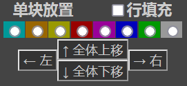 

### 方块朝向序号

|序号|0|1|2|3|
|:--:|:--:|:--:|:--:|:--:|
|方向|南（朝下）|东（朝右）|北（朝上）|西（朝右）|

- 和页面上选择方块朝向的从上到下的顺序对应（从上到下，南东北西）
  
  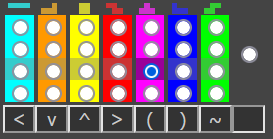 

### 场地对应编号

场地本身由 **3行缓冲区 + 20行正常场地 + 1行垃圾行位置** 总计 **24行 × 10列 = 240块** 构成。
从左上开始，从左到右，从上到下，从0一直编号到239。
场地存储在一维数组 （int[]）当中。

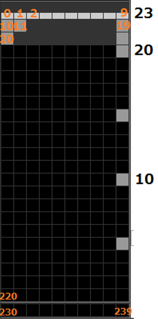 

<br/>

### fumen谱面码数据概览

例：v115@  bhA8SeAAA  bhAAA8ReAAA  chAAA8QeAAA

|v115@|bhA8SeAAA|bhAAA8ReAAA|chAAA8QeAAA|
|:--:|:--:|:--:|:--:|
|前缀|一页数据|一页数据|一页数据|

#### 前缀：（ v115@ ）

v - 查看方式，有v（普通视图）、m（迷你查看视图）、d/D（列表查看视图）
115 - 当前版本V1.15（一般可能会在较早的fumen谱中看到v110，比如 [nazo](https://teatube.cn/nazo/) 当中的谱面）
@ - 分隔符

可以试着在fumen链接当中将 v115 换成 m115、d115、D115
（只对原版fumen有效，对 fumen for mobile 没有作用）

[https://teatube.cn/f/?v115@bhA8SeAAAbhAAA8ReAAAchAAA8QeAAA](https://teatube.cn/f/?v115@bhA8SeAAAbhAAA8ReAAAchAAA8QeAAA)
[https://teatube.cn/f/?m115@bhA8SeAAAbhAAA8ReAAAchAAA8QeAAA](https://teatube.cn/f/?m115@bhA8SeAAAbhAAA8ReAAAchAAA8QeAAA)
[https://teatube.cn/f/?d115@bhA8SeAAAbhAAA8ReAAAchAAA8QeAAA](https://teatube.cn/f/?d115@bhA8SeAAAbhAAA8ReAAAchAAA8QeAAA)
[https://teatube.cn/f/?D115@bhA8SeAAAbhAAA8ReAAAchAAA8QeAAA](https://teatube.cn/f/?D115@bhA8SeAAAbhAAA8ReAAAchAAA8QeAAA)

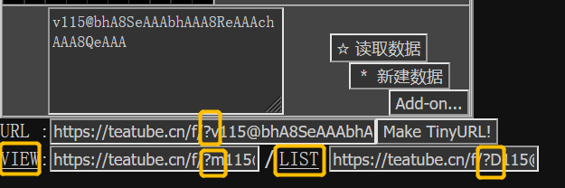 

- VIEW 和 LIST 这里实际上是可以点的哦……？

#### 分页构成

- 没有分割符，分页按照逻辑切分，具体逻辑见下面的章节
- 所有的页面都基于 **和上一页的状态** **的变化** 生成，因此 **不能切分一段独立** 、**不能调换顺序**，否则数据会损坏 / 变成奇怪的样子了！

### 数据格式

fumen当中采用了自己创造的 **64进制** ，其中对应表如下：

|+|0|1|2|3|4|5|6|7|8|9|
|:--:|:--:|:--:|:--:|:--:|:--:|:--:|:--:|:--:|:--:|:--:|
|**00**|A|B|C|D|E|F|G|H|I|J|
|**10**|K|L|M|N|O|P|Q|R|S|T|
|**20**|U|V|W|X|Y|Z|a|b|c|d|
|**30**|e|f|g|h|i|j|k|l|m|n|
|**40**|o|p|q|r|s|t|u|v|w|x|
|**50**|y|z|0|1|2|3|4|5|6|7|
|**60**|8|9|+|/|||||||

并且和普通进制不同的是，**靠右/靠后的是高位**

```python
2 位的情况下
AA =   0 =  0 +  0 * 64 
BA =   1 =  1 +  0 * 64
CA =   2 =  2 +  0 * 64
...
/A =  63 = 63 +  0 * 64
AB =  64 =  0 +  1 * 64
..
// = 4095 = 63 + 63 * 64

3 位的情况下
AAA = 0 =   0 +  0 * 64 + 0 * 64 * 64
...
abc = 116442 = 26 + 27 * 64 + 28 * 64 * 64
...
```

## 二、场地信息

构成一个新页面的起点就是场地信息。

我们以 v115@ ghE8Je AgH vhA AAA 为例分析：

[https://teatube.cn/f/?v115@ghE8JeAgHvhAAAA](https://teatube.cn/f/?v115@ghE8JeAgHvhAAAA)

|v115@|ghE8Je|AgH|vhA|AAA|
|--|--|--|--|--|
|前缀|**第一页·场地**|第一页·块与标识|**第二页·场地**|第二页·块与标识|

接下来我们分析一下 `ghE8Je` 是如何变成下方场地的：

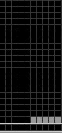 

### 场地数据构成 · 单页的情况

<br/>

场地的数据，由 数个 2位64进制（见上方 [数据格式](https://) 部分）构成，先转换为十进制：

```python
gh = (32,33) base 64 = 32 + 33 * 64 = 2144
E8 = ( 4,60) base 64 =  4 + 60 * 64 = 3844
Je = ( 9,30) base 64 =  9 + 30 * 64 = 1929
```

再对每对数进行 **带余除法**，除以总块数 240 （ [为什么是 240 不是 200？](https://)）获得 **商** 和 **余数** 。

```python
gh => 2144 ÷ 240 =  8 …… 224
E8 => 3844 ÷ 240 = 16 ……   4
Je => 1929 ÷ 240 =  8 ……   9
```

实际的场地，按照[场地对应编号](https://)当中描述的顺序，这个描述应该是

```python
「空位 225 个」→「灰色块 5 个」→「空位 10 个」
```

而上方的 **商** 和 **余数** 的实际意义是：

```python
商 = 方块编号 + 8
余数 = 连续块数 - 1

方块编号 = 商 - 8
连续块数 = 余数 + 1
```

也就是

```python
gh => 方块编号为  8 - 8 的 连续 224 + 1 个 => 空位 225 个
E8 => 方块编号为 16 - 8 的 连续   4 + 1 个 => 灰色   5 个
Je => 方块编号为  8 - 8 的 连续   9 + 1 个 => 空位  10 个
```

对上了。

反向写一下的话就是

```python
240 *  ( [0] + 8 ) + [225] - 1 = 2144 => gh 
240 *  ( [8] + 8 ) + [  5] - 1 = 3844 => E8 
240 *  ( [0] + 8 ) + [ 10] - 1 = 1929 => Je 
```

### 场地数据构成 · 多页的情况

多页其实和单页没有特别大的差别，不过需要改一下上面的 **商** 的定义：

```python
商 = 与上一页 同位置方块编号的差 + 8 (取值范围 0 <= 商值 <= 16 )
余数 = 连续块数 - 1 (取值范围 0 <= 余数 <= 239)

与上一页 方块编号的差 = 商 - 8 
连续块数 = 余数 + 1

240 *  ( [与上一页 方块编号的差] + 8 ) + [连续块数] - 1 = 场地编码十进制值
```

我们把 **第一页** 的 **上一页** 定义为 空场地。

这时 **第一页** 和 空场地 的差，就和 **方块编号** 一样了。

> 特别注意：与上一页 同位置方块编号的差，是以 **计算完 方块摆放 与 事件标识** **之后的场地** 进行比较的！
> 
> 如果每一页都只是摆放方块的时候，那么整个场地 **与上一页 同位置方块编号的差** 就一直都为 0 ，视为 **页面和上一页相比完全没变**

如果页面和上一页相比完全没变，那么

```python
与上一页 同位置方块编号的差 = 0 
连续块数 = 240 

场地编码十进制值 = 240 *  ( [0] + 8 ) + [240] - 1 = 2159

转换为 64 进制：--- 查表获得对应字符
2159 ÷ 64 = 33 …… 47 --- v
  33 ÷ 64 =  0 …… 33 --- h

换种写法：
64 | 2159 …… 47 --- v
       33 …… 33 --- h
```

**特别地**，页面和上一页相比完全没变的时候，在 `vh` 后需要加一个 64进制字符 表示当前页面重复次数

例：

```python
vhA => 当前页面重复 1 次
vhB => 当前页面重复 2 次 
vhC => 当前页面重复 3 次
...
vh/ => 当前页面重复 64 次 

vh/....vhA... => 重复大于64次的时候，重新附加vh
vh/....vhB... => 重复大于64次后，又重复了 2 次
...
```

### 到此为止的总结

|v115@|ghE8Je|AgH|vhA|AAA|
|--|--|--|--|--|
|前缀|**第一页·场地**|第一页·块与标识|**第二页·场地**|第二页·块与标识|

我们可以看到，第一页的结果是

 

第二页的场地因为是vhA，所以和第一页内容完全相同

#### 场地 → 代码

```python
按照从左到右，从上到下的顺序，
记录 [与上一页 同位置方块编号的差]
以及 差相同的 [连续块数]

240 *  ( [与上一页 方块编号的差] + 8 ) + [连续块数] - 1 = 场地编码十进制值

十进制转换为 64进制
场地编码十进制值 ÷ 64 = 商 …… 64进制的第一位
              商 ÷ 64 =  0 …… 64进制的第二位（等于商）
              
页面和上一页相比完全没变的时候为 vh
在 vh 后需要加一个 64进制字符 表示当前页面重复次数
如：
vhA 重复 1 次 
vhB 重复 2 次
..
vh/ 重复 64 次
大于64次时重新加vhA
```

#### 代码 → 场地

```python
两个字符切一次
如果是vh，则根据vh后的字符重复次数重复相应次数上一页
如果不是，则正常计算场地变化

2位64进制 => 十进制值
十进制值 ÷ 240 = 商 …… 余数
与上一页 方块编号的差 = 商 - 8 
连续块数 = 余数 + 1

连续块数合计240时结束场地
```

<br/>

## 三、放置当前块 · 状态事件标识（Flag）

我们还以 v115@ ghE8Je AgH vhA AAA 为例分析：

[https://teatube.cn/f/?v115@ghE8JeAgHvhAAAA](https://teatube.cn/f/?v115@ghE8JeAgHvhAAAA)

|v115@|ghE8Je|AgH|vhA|AAA|
|--|--|--|--|--|
|前缀|第一页·场地|**第一页·块与标识**|第二页·场地|**第二页·块与标识**|

块与标识 使用 **3位 64进制** 的数来表示，以上方 `AgH` 为例：

```python
AgH = (0,32,7) base 64 = 0 + 32 * 64 + 7 * 64 * 64 = 30720
 8 |    30720 …… 0 --- 当前块编号 0 无当前块 1-7 对应方块编号 I L O Z T J S    
  4 |    3840 …… 0 --- 当前块方向 0 无当前块/朝南（朝下）1 朝东（朝右）2 朝北（朝上）3 朝西（朝左）
 240 |    960 …… 0 --- 当前块位置 0 左上（因为无当前块）其他 方块的具体位置 （参考场地位置和鼠标点击位置）
    2 |     4 …… 0 --- 事件：上升 0 不上升 1 上升1行
     2 |    2 …… 0 --- 事件：镜像 0 不镜像 1 场地镜像处理
      2 |   1 …… 1 --- 状态：配色 1 采用 基准 guideline 配色 0 采用 sega/TGM 配色 *仅第一个生效
       2 |  0 …… 0 --- 状态：注释 0 注释无变化 1 注释有变化 
        2 | 0 …… 0 --- 事件：锁定 0 锁定 1 不锁定
            0
```

### 当前块编号：

|序号|0|1|2|3|4|5|6|7|8|
|:--:|:--:|:--:|:--:|:--:|:--:|:--:|:--:|:--:|:--:|
|种类|空|I|L|O|Z|T|J|S|灰|

### 当前块方向：

|序号|0|1|2|3|
|:--:|:--:|:--:|:--:|:--:|
|方向|无当前块 / 南（朝下）|东（朝右）|北（朝上）|西（朝左）|

### 当前块位置：

具体位置和场地位置编号相同（从左到右，从上到下，0~239）

**特别注意：** 方块的四向基准 **并非都是方块旋转中心** （箭头为实际方块位置的基准（鼠标位置））

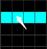 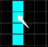 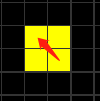

 

TJL为旋转中心。

 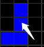 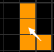 

<br/>

### 事件：上升

下一页：下方垃圾行提升，锁定时有效。

同时第23行数据删除。

### 事件：镜像

下一页：整个场地镜像，配色保留原配色。锁定时有效。

### 状态：配色

仅对第一个 方块·标识 中的变量有效。

为 1 时，为guideline / 基准配色；

为 0 时，为 sega / TGM 经典配色。

### 状态：注释

为 0 时，无注释

为 1 时，在后方增加注释，注释编码具体看下一节

### 事件：锁定

下一页：锁定当前方块位置，并改变场地

- 上升、镜像必须在锁定开启时才有效

### 特别说明

场地和上一页比较的时候，需要先将上一页依次结算 **锁定、上升、镜像** ，结算后再比较场地差异。

## 四、注释

例：[v115@vhAAgW FA BU4nD GBAAA](https://teatube.cn/f/?v115@vhAAgWBABBAAA)

|v115@|vhA|AgW|FA|BU4nD|GBAAA|
|:--:|:--:|:--:|:--:|:--:|:--:|
|前缀|场地|方块编号0、方向0、位置0、<br/>上升0、镜像0、配色1、**注释1**、锁定0<br/>**注释 1 => 注释有变化**|**注释字母数**<br/>两位64进制<br/>最大4096|**注释文：<br/>注释4字母<br/>对应<br/>数据5字母**|**注释文：<br/>注释4字母<br/>对应<br/>数据5字母**|

上方代码注释为：abcdf

### 注释处理步骤

#### 1、对 注释进行 `escape()` 变成ASCII代码 

`escape()` 函数功能请参考[这里](https://developer.mozilla.org/zh-CN/docs/Web/JavaScript/Reference/Global_Objects/escape)

字母和普通字符在`escape()`后为自己本身

汉字进行 `escape()` 后会变成 %u +  4位16进制，例如：

```javascript
>> escape("abc123");
<-"abc123" 
>> escape("啊");
<-"%u554A" 
>> escape("茶")
<-"%u8336"
>> escape("管")
<- "%u7BA1"
```

#### 2、对变成ASCII代码的注释，四个为一组，用下方的 注释用 96进制转换表，换成4个1~95的数字（不够4个用0补）

|+|0|1|2|3|4|5|6|7|8|9|
|:--:|:--:|:--:|:--:|:--:|:--:|:--:|:--:|:--:|:--:|:--:|
|**00**|空 |!|“|#|$|%|&|‘|(|)|
|**10**|*|+|,|-|.|/|0|1|2|3|
|**20**|4|5|6|7|8|9|:|;|<|=|
|**30**|>|?|@|A|B|C|D|E|F|G|
|**40**|H|I|J|K|L|M|N|O|P|Q|
|**50**|R|S|T|U|V|W|X|Y|Z|[|
|**60**|\||]|^|_|`|a|b|c|d|e|
|**70**|f|g|h|i|j|k|l|m|n|o|
|**80**|p|q|r|s|t|u|v|w|x|y|
|**90**|z|{|\||}|~||||||

例：

```python
abc → abc → (65,66,67,0)
啊 → %u554A → (5,85,21,21) (20,33,0,0)
```

#### 3、换成十进制后，按照之前的 64进制表，变成 5位 64进制

```python

abc → abc → (65,66,67,0) base 96 = 65 + 66 * 96 + 67 * 96 ^ 2 = 623873
64 | 623873 ……  1 → B
  64 | 9748 …… 20 → U
   64 | 153 …… 25 → Y
    64 |  2 ……  2 → C
          0 ……  0 → A
右侧对应64进制表
abc → BUYCA

啊 → %u554A → (5,85,21,21) (20,33,0,0)
(5,85,21,21) → 5 + 85 * 96 + 21 * 96 ^ 2 + 21 * 96 ^ 3 = 18781157
64 | 18781157 …… 37 → l
  64 | 293455 …… 15 → P
    64 | 4585 …… 41 → p
      64 | 71 ……  7 → H
            1 ……  1 → B
(20,33,0,0) → 20 + 33 * 96 = 3188
64 | 3188 …… 52 → 0
  64 | 49 …… 49 → x
   64 | 0 ……  0 → A
   64 | 0 ……  0 → A
   64 | 0 ……  0 → A
啊 → lPpHB0xAAA
```

#### 4、前方加上注释文字在 escape() 处理过后的文字总数，用2位64进制数表示，最大4095个（以1个汉字占6个计算，682.5个汉字）

```python
abc → DA BUYCA
啊 → GA lPpHB0xAAA
```

### #Q= 前缀注释的 特殊处理

#Q= 是原版当中的 Quiz / 問 按键，可以生成一包块，并且会随着摆块编号而变化；
此时注释前缀会加一串`#Q=[A](B)CDEFGH`的序列。
这串序列可以直接作用在hold `[hold]` 、当前块`(active)`、之后的next上。

当有#Q= 前缀时，如果方块有锁定，那么 **判断注释是否变化时**，需要以 **锁定块后**，**#Q推进一块后**，**计算后** 的注释结果变化为准。

## 分析过程梳理 与 示例习题：

|前缀|场地变化|方块与标识|注释字符数<br/>（如果注释有变）|注释正文<br/>（如果注释有变）|
|--|:--:|:--:|:--:|:--:|
|v115@ <br/>或其他|两个字符一切分，<br/>方块总数达到240为止；<br/>无变化（vh）则加一个<br/>64进制字符，<br/>用以表示重复次数|由三个字母构成，承载方块<br/>编号、方向、位置、上升<br/>镜像、配色、注释、锁定<br/>的状态与事件标识|两个字符<br/>表示注释在escape()<br/>变成ASCII后的字符数；<br/>|用5位64进制<br/>对应4个ASCII字符|

<br/>

以 `v115@vhCRQYOAlPBBCQoDfE10t2A0bAAAUmBvsBlhB8AeG8?TtBvhCKhSeAlPZOB4sDfE1Sj9Bl/3RB0EEfE3v2AClfrHBU?kAAAFlQCA0bAAAAAA`为例，拆分如下

<br/>

|前缀|场地变化|方块与标识|注释<br/>字符数|注释正文|
|--|--|--|--|--|
|v115@|vhC|RQY|OA|lPBBC QoDfE 10t2A 0bAAA|
|||UmB|||
|||vsB|||
||lh B8 Ae G8|TtB|||
||vhC|KhS|eA|lPZOB 4sDfE 1Sj9B l/3RB 0EEfE 3v2AC lfrHB UkAAA|
|||FlQ|CA|0bAAA|
|||AAA|||

第一行：

|前缀|场地变化|方块与标识|注释<br/>字符数|注释正文|
|--|--|--|--|--|
|v115@|vhC|RQY|OA|lPBBC QoDfE 10t2A 0bAAA|
|版本115|（不计摆块锁定）<br/>场地无变化，持续3页 1/3|(17,16,24)<br/>base 64 <br/>= 99345<br/>进一步分析见下表|14|64进制转10进制，再转注释用96进制<br/>转换后结果为：<br/>%u5F 00%u 5C40 T2<br/>对应文字 ”开局T2“|

<br/>

|除数|被除数/上一行的商|余数|对应属性|实际意义|
|--:|--:|--:|--|--|
|8|99345|1|当前块编号|当前块为 I|
|4|12418|2|当前块方向|当前块朝北 / 朝上|
|240|3104|224|当前块位置|I块位置在 地面从下往上数<br/>（不算垃圾行的）第1行 <br/>的 3-6 列<br/>（223 **224** 225 226）|
|2|12|0|上升标识|无上升|
|2|6|0|镜像标识|无镜像|
|2|3|1|配色|guideline配色|
|2|1|1|注释|有注释|
|2|0|0|锁定|有锁定<br/>（锁定标识为1时不锁）|

<br/>

<br/>

|P2|场地|方块与标识|注释 <br/>字符数|注释正文|
|--|--|--|--|--|
|||UmB|||
||2/3|(20,38,1) => 6548 => 4,2,204,0,0,0,0,0 <br/>=> 方块Z、朝上（北）、位置 (203 **204** 214 215)，无其他变化|||
|||vsB|||
||3/3|(47,44,1) => 6959 => 7,1,217,0,0,0,0,0<br/>=> 方块S、朝右（东）、位置 (206 216 **217** 227), 无其他变化|||
||lh B8 Ae G8|TtB|||
||场地变化<br/>解析见下表|(19,45,1) => 6995 => 3,2,218,0,0,0,0<br/>=> 方块O、朝上（北）、位置 (**218** 219 228 229),无其他变化|||

<br/>

||lh|B8|Ae|G8|
|--|--|--|--|--|
|64进制|(37,33)|(1,60)|(0,30)|(6,60)|
|转为十进制|2149|3841|1920|3846|
|240带余除法<br/>的余数和商|(229,8)|(1,16)|(0,8)|(6,16)|
|实际意义|连续 230块 变化无<br/>(8-8=0)|连续 2块 变化+8<br/>（16 - 8 - 空0）= 灰8|连续 1块 变化无<br/>(8-8=0)|连续 2块 变化+8 <br/>（16 - 8 - 空0）= 灰8|

<br/>

<br/>

|P3|场地变化|方块与标识|注释<br/>字符数|注释正文|
|--|--|--|--|--|
||vhC|KhS|eA|lPZOB 4sDfE 1Sj9B <br/>l/3RB 0EEfE 3v2AC <br/>lfrHB UkAAA|
||（不计摆块锁定） <br/>场地无变化，<br/>持续3页 1/3|(10,33,18) =>75850<br/>=> 2,1,210,1,0,0,1,0<br/>=> 方块L、朝右、(200 **210** 220 221)<br/>**垃圾行上升**、有注释变化|30|转换后为<br/>%u57 83%u 573E <br/>%u88 4C%u 751F <br/>%u65 48<br/>对应文字“垃圾行生效”|
|||FlQ|CA|0bAAA|
|||(5,37,16) => 67909<br/>=> 5,0,202,0,0,0,1,0<br/>=> 方块T，朝下，(201 **202** 203 212)<br/>有注释变化|2|转换后结果为 T2<br/>对应文字“T2”|
|||AAA|||
|||无变化|||

<br/>

## 其他

### v110@

20+3行缓冲区变为20+1行缓冲区，其他逻辑和现在相同

### 每隔47个字符会加一个?

原因未知，得问Mihys
去掉或加上不影响分析

### 字符/页面上限

理论上按照这个算法应该没有上限。
有上限的是 **浏览器** 或者 **服务端** 的限制。
例如：网页的fumen最大页数 2000，导出数据的最大字符数为 32768 等……

### 原PPT的方块朝向……好像写反了？

1状态是朝右的，上北下南左西右东……没错吧？
原ppt里1状态是 West，3状态是 East
根据实际分析应该是写反了

<br/>

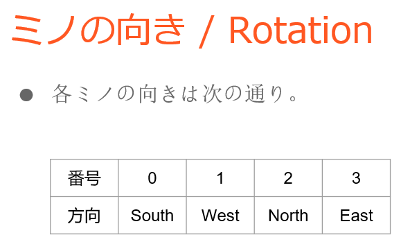 