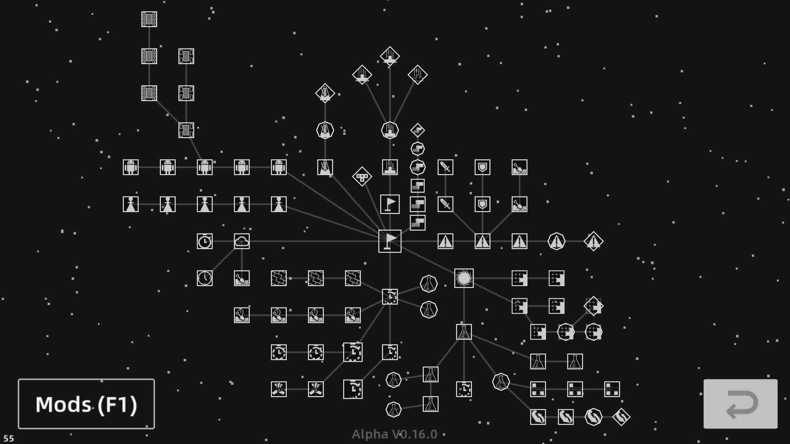

# Techmino 模式切分 （0.16.0）

## 消行竞速 极其 变体 (Type-B)

- 竞速 
	* **竞速 40L**
		+ ***竞速 五连块***
		+ ***竞速 MPH*** 
	* 竞速 20L
	* 竞速 10L
	* 竞速 100L
		+ ***干旱 100L***
		+ _干旱+ 100L_
	* **禅 200L**
		+ **无尽模式** 
	* 竞速 400L
	* 竞速 1000L
- 挖掘
	* **挖掘 10L**
	* 挖掘 40L
	* 挖掘 100L
	* 挖掘 400L
	* **无尽挖掘模式**
- _堆叠_
	* ***堆叠 20L***
	* _堆叠 40L_
	* _堆叠 100L_

## 下落速度提升·方块大师类 (Type-A)

- 马拉松
	* **马拉松 普通**
	* 马拉松 困难
	* _节奏模式_
		+ ***节奏模式 简单***
		+ _节奏模式 困难_
		+ _节奏模式 极限_
- **高速经典**
- **大师**
	* 大师 普通（原疯狂）
	* 大师 困难（原极限）
	* 大师 终点
	* ***大师 虚幻*** 
- 隐形
	* **隐形 半隐**
	* 隐形 全隐
	* 隐形 瞬隐
	* 隐形 瞬隐+
	* 隐形 啊这 （无场地展示）
	* 隐形 不会吧 （只有声音信息）
	* ***宗师 EX***

## 生存挖掘类 (Type-C)

- 生存
	* **生存 简单**
	* 生存 普通
		+ **进攻 困难**
		+ 进攻 极限
		+ --
		+ **防守 困难**
		+ 防守 疯狂
		+ --
		+ **挖掘 困难**
		+ 挖掘 极限
	* 生存 困难
	* 生存 疯狂
	* 生存 极限

## 技巧类

- 大爆炸 （咕）
- **竞速 100攻击**
	* 科研 普通(+)
	* 科研 困难(+)
	* 科研 极简(+)
	* **自攻自受 普通**
	* 自攻自受 困难
	* 自攻自受 疯狂
	* 自攻自受 极限
- TSD 挑战
	* **TSD 挑战 简单**
	* TSD 挑战 困难
	* TSD 挑战 极限
- 全清系列
	* 全清训练
		+ **全清训练 普通**
		+ 全清训练 疯狂
	* 全清挑战
		+ **全清挑战 普通**
		+ 全清挑战 困难
		+ 全清挑战 疯狂
	* **无尽全清挑战**
- C4W 练习
	* **C4W 练习 普通**
	* C4W 练习 疯狂

## 对战类

- 单挑
	* **单挑 简单**
	* 单挑 普通
	* 单挑 困难
	* 单挑 疯狂
	* 单挑 极限
- 回合制
	* **回合制 简单**
	* 回合制 普通
	* 回合制 困难
	* 回合制 疯狂
	* 回合制 极限
- 49人混战
	* **49人混战 简单**
	* 49人混战 困难
	* 49人混战 极限
- 99人混战
	* **99人混战 简单**
	* 99人混战 困难
	* 99人混战 极限

