# 快速瑞士制 （自助瑞士制）以及其他赛制的简单说明
--------------------------------------------------
## 一.常用赛制科普

在各种比赛当中，有着形形色色的赛制。这里我们就从最基本的形式开始吧~

### 1.单败淘汰

这是大家最熟悉的赛制。一次定胜负。
32进16,16进8,8进4,4进2,最后冠亚军争夺战。有时会追加季军争夺战。
为了减少因为一局比赛失误而爆冷出局的情况，一般一次比赛都要匹配多盘游戏。

示例：

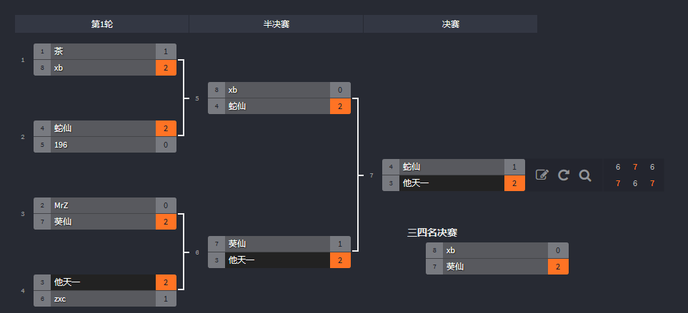

优点是赛程少，时间快，简单易懂。
缺点也很明显：会有因为选手编排，或突发状况，而出现排名爆冷的情况；并且选手参与度过少。
是目前方块比赛当中选手筛查阶段采用的快速筛选人员的赛制。

### 2.双败淘汰

为减少因为偶然一次爆冷而导致翻车的情况，双败淘汰赛当中，每个人都提供了两条命。
两条命当中，失败一次则进入败者组，而在败者组再次失败则被淘汰。
胜者组最终的头筹、和败者组最终的头筹进行总决赛（示例当中，他天一对zxc）。

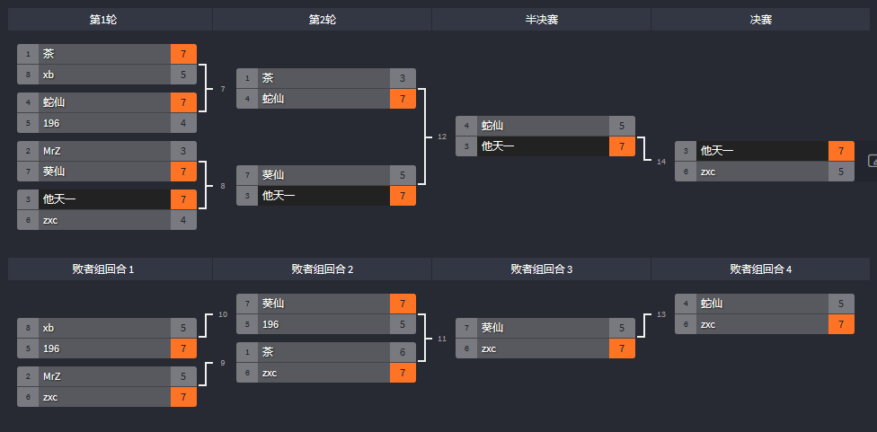

一般会有总决赛当中，胜者组头筹两条命的设定。
败者组头筹需要连续击败胜者组头筹两次。
（示例当中，zxc需要连续击败他天一两次才能获得冠军）

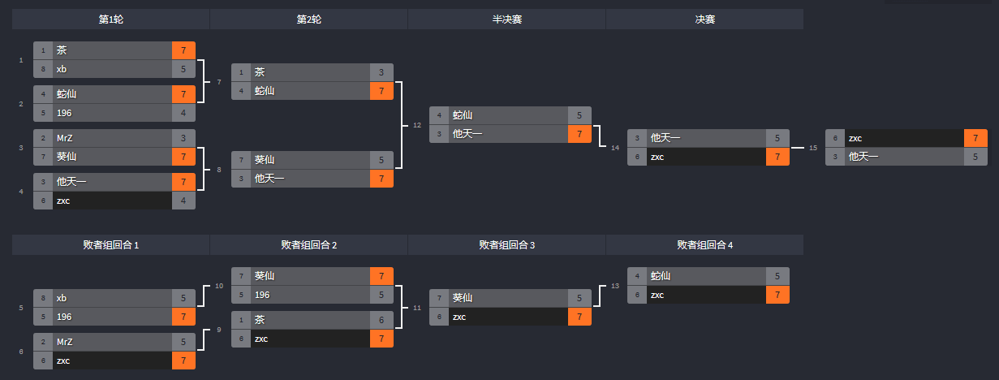

优点是赛程较少，时间也较快。
缺点是仍然会有部分选手编排、突发状况而受较大影响而爆冷的情况，但总体比单败淘汰要好。
并且选手参与度仍然不够，仍然会有1/4的选手二轮游。

不过相对来讲，比较方便比赛直播并且最适合比赛的。
是目前大型方块比赛当中最主要的赛制，尤其被后半程比赛使用。

有部分比赛具有双败淘汰拥有分离选手的设定。
起点就在败者组（通常为参加双败的选手的排名后半）。

### 3.循环赛

循环赛，即将玩家和所有对手都进行比赛一次的赛制。

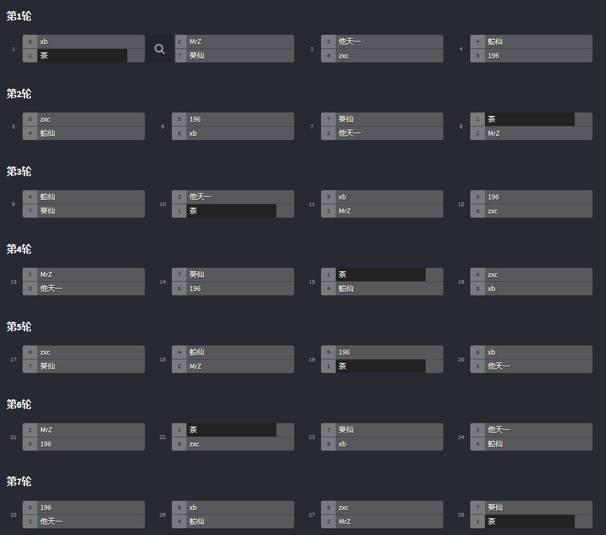

由于大部分方块不存在主客场问题，所以在采用此赛制的时候都是单循环赛。（即比赛双方只比一盘）

优点是比赛充分，玩家参与度最高，每个人参与度都相同。偶然影响性最小，并且可以随时进行任何一场比赛。
缺点是盘数多，场数非常多，8个人就需要进行8x7=56场比赛，100人则需要100*99=9900场比赛，每个人都要打99轮……

循环赛一般用于比赛前半程的小组赛阶段，或人数较少的情况。

### 4.瑞士制

淘汰赛参与度不够，过于具有偶然性；循环赛虽然比赛充分，但是比赛场次又过多；
那么是否有一种赛制，能够将偶然性影响降到最低，而又能让大家充分的进行比赛的赛制呢？

这就是瑞士制了。

> 瑞士制：又称积分循环制（勿与循环赛混淆），常用于国际象棋比赛。最早出现在1895年在瑞士苏黎世举办的比赛中，故名。棋类比赛的专用的赛制之一，适用于国际象棋、中国象棋、围棋、五子棋、军棋等棋种的使用。 基本原则是避免种子选手一开始就交锋、拼掉。是目前为止比较科学合理、用得最多的一种赛制。英语缩写为SS，即Swiss System。
> ——百度百科

瑞士制将比分最接近的人放在一起比赛；胜者对胜者，败者对败者。
一般情况下也都是相同的大比分的选手放在一起比。

以8人瑞士制为例：

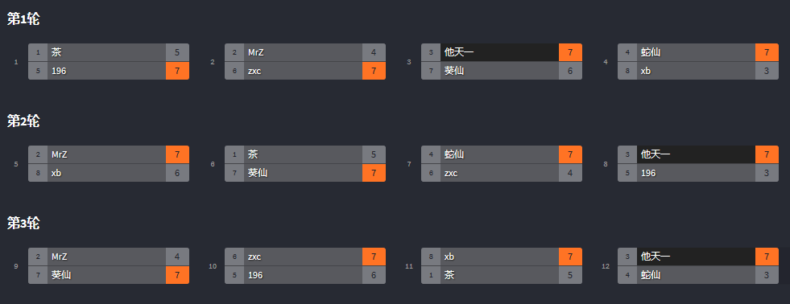

第一轮当中，196、zxc、他天一、蛇仙 **获1胜**；茶、MrZ、葵仙、xb **得1败**；
第二轮当中，蛇仙、他天一 **获2胜** 196、zxc、MrZ、葵仙 **1胜1败**；茶、xb **2败**
最终轮当中，他天一匹配蛇仙，他天一**获3胜**；（下略）茶**3战全败**。

那么对于中间选手，其排名如何确定呢？具体根据赛事设置决定：

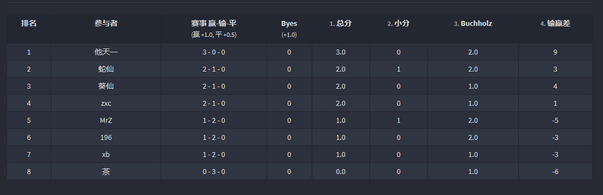

小分：与同分对手相比，获胜的局数；比如示例的蛇仙打赢zxc一次，计1.0小分；
输赢差：即净胜分数。总得分和总失分作差；
布霍兹破同分：瑞士制特别计分。记录所打过的对手的分数之和（减去一个最高分和一个最低分）。专门用于瑞士制打破平局。

这三个属性的优先级是根据不同比赛和不同项目决定的

另一方面，如果你把选手按照指定方式编排好的话，你会发现：
实际上你能从上面的瑞士制当中，提出一个单败淘汰的比赛的壳子。

换言之，瑞士制更像是将单败淘汰当中被淘汰的选手也放在了一起比，使得所有选手都获得了同样的参与度。
而进行的轮数和单败淘汰赛一致，每轮的每盘比赛都同时进行的话，实际总比赛时间并没有大改动。

瑞士制的优点非常明显，消除偶然性的同时，也让比赛轮次大大减少。
缺点则有两个：
1.中间选手的并列情况名次区分较弱
2.如果有一轮当中的一盘比赛因为事故推迟，或时间过长，则会影响所有参赛选手下一轮的比赛。

--------------------------------------------------
## 二、快速瑞士制……为什么叫快速？

传统瑞士制如果一盘一盘的进行下去的话，其持续时间也比较长，比较不利于赛事进行，而且**选手非常容易变成鸽子**。

茶茶之前有大半夜3点多的时候，发现另一个半球的人们，在C2里举办者接近一周一次的 QuickFire 。
虽然 QuickFire 采用的是淘汰赛制，但是却在两三个小时就进行完全部的比赛，在一定程度上避免了选手鸽子而影响比赛进程的情况。
（因为真的鸽子直接不签到，不参加，不影响比赛进程）

而瑞士制的进行轮数，和单败淘汰是一样的。那么一个新的概念 **快速瑞士制** 便应运而生。
签到，比赛，一次比完，一气呵成。

得益于 Challonge 的强大系统，选手可以自主参加、自主签到、自主比赛、自主报分。
所以当时的快速瑞士制，还有一个名字 **自助瑞士制** 。
在所有选手都熟悉比赛系统的情况下，主办方甚至只需要进行简单的赛程维护，
（如比赛当中有人因特殊情况退出比赛，需要进行手动取消资格；报分出现错误时提供修正等）就可以完成比赛。

有多快呢？[方块研究群10周年纪念 快速瑞士制](https://challonge.com/zh_CN/ts10th)当中，
有**100名选手**报名参加。**93名选手**最终完成了比赛，并对所有人排出了名次；
一共进行了**总计340盘**抢7胜的比赛，也是目前方块研究群举办的人数规模最大的比赛。

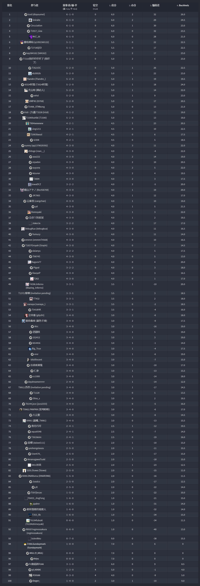
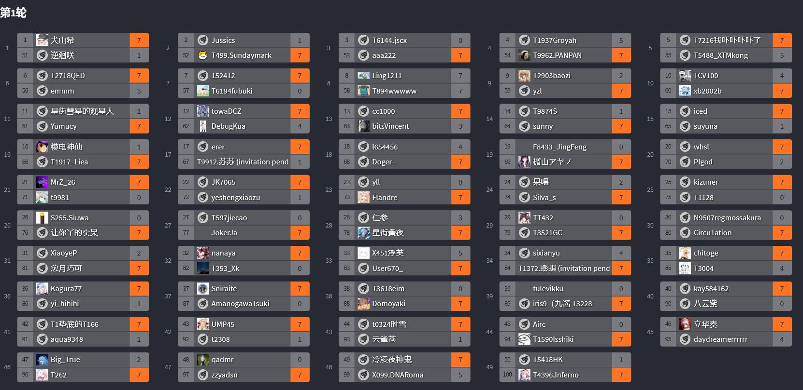
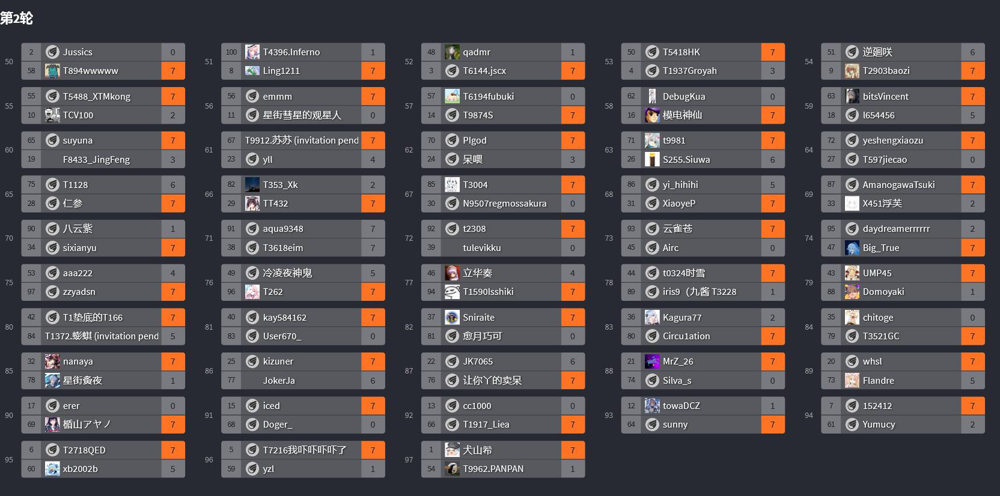
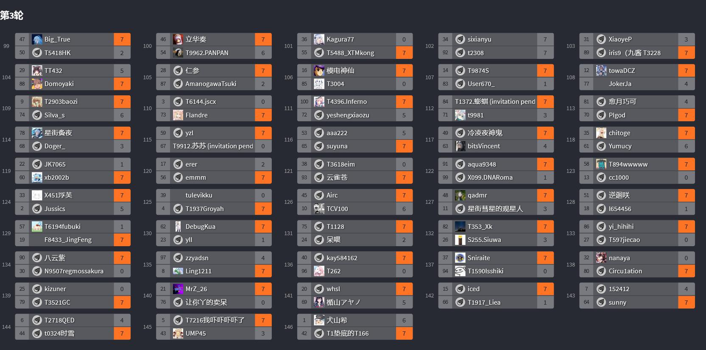
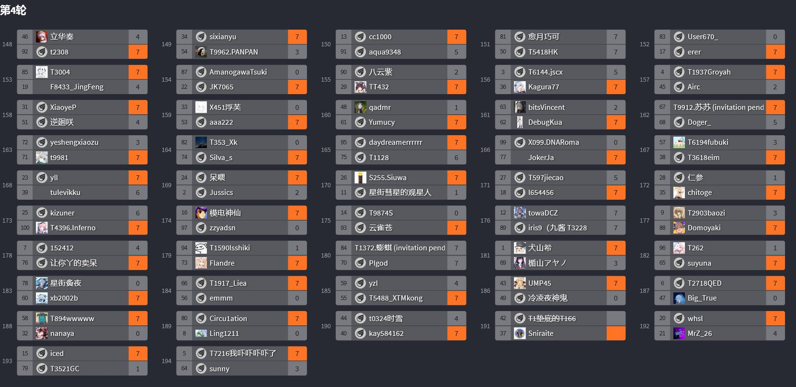
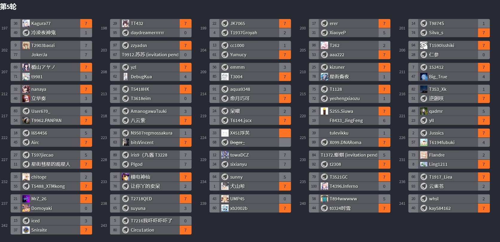
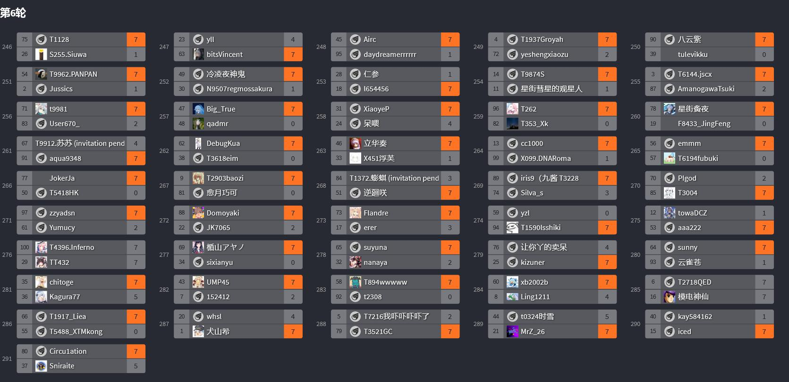
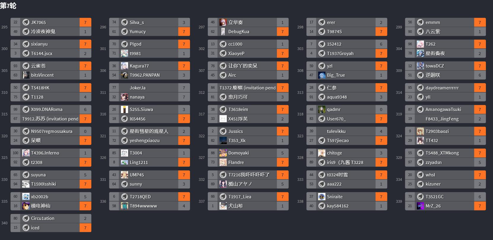

这种比赛放到其他情况下，肯定是一个月要出去的。而这场比赛，只进行了**3个小时**。

--------------------------------------------------
## 三、其他有意思的赛制

### [记录在atwiki的段位战](https://w.atwiki.jp/dannisen/pages/19.html)

- 有青铜、白银、黄金、钻石、大师、传说六个段位（依次递进）（参考一下环游记的段位名称）
- 同段位之间的人进行脱颖而出的比赛
- 比赛的顺序按照报名顺序进行排列
- 车轮战 / 擂台赛（赢者留下，败者排到队尾）
	* 如报名顺序为 A、B、C、D、E、F，则A和B最先比赛，A获胜则B到队尾，A和C进行比赛，排序变为A、C、D、E、F、B。
	* 此时 A 记 +1段位分（下写pt），B -1pt（青铜不减分）
	* 比赛抢七胜
- 比赛获胜时 +1pt，失败时 -1pt；
- 比赛结束时 +3pt 时则升段，-3pt 时则降段。升段或降段时 pt归零。
- 青铜失败时不减分，传说 +3pt 不再升段。

- 结束条件
	 * 因 升段 或 降段 导致小组人数小于3人
	 * 到达指定的直播时长（？）（原文为ニコニコ生放送で試合を開始してから4枠を終える）
	 * 由主办方决定的其他情况

- 人数分配示例
|参加人数	|房间数	|
|:--:		|:--:	|
|3~5		|1		|
|6~8		|2		|
|9~12		|3		|
|13~17		|4		|
|18~22		|5		|
|22~26		|6		|
|27~33		|7		|

- 杂项
	 * 可以中途加入。但需要在最后一轮之前。（原文为途中参加は可能です、ただし最期の枠の前枠までとします。 ）
	 * **中途弃权时，当日不可再参加比赛。**
	 * 未确定比赛时中途弃权无任何惩罚。
	 * 出现非人为意外情况，如网络波动等，适用于以下情况：
		 + 未确定排组时 → 放到队尾
		 + 确定排组后弃权，视为不战则败，并直接降段
		 + 中途掉线 → 恢复后继续比赛，若不能恢复则视为弃权。
	 * 比赛单日不会和相同的人进行二次比赛。

### 冒泡赛

电子竞技中常见的一种比赛方式。一般为比赛中的前几名已经确定进入半决赛，而后几名为了争取半决赛资格进行的比赛方式。
其比赛方式是最后一名由下而上依次对上一名进行挑战，形如水中冒泡，故曰冒泡赛。

### 佩奇制

小组赛确定前4晋级后，假设小组赛排名第一~第四分别为ABCD
则首先A和B打，胜者为决赛名额
其次C和D打，胜者和之前AB的败者打，打完的胜者进入决赛

*本质为 含有分离选手的 双败淘汰（A,B在上半场，C,D在下半场）

### 双佩奇制

和佩奇制相同，不过一般为两个小组的每组前四。
*本质仍然为 含有分离选手的 双败淘汰（A1,A2,B1,B2在上半场，A3,A4,B3,B4在下半场）

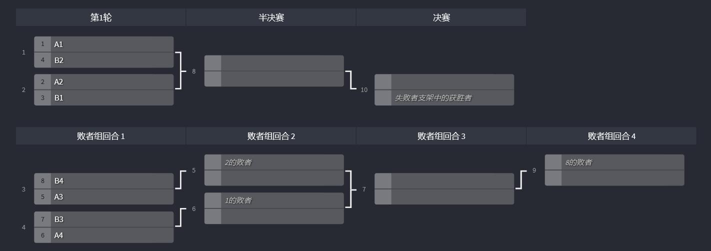

### Dota2 Ti2赛制

前半部分小组赛为循环赛，根据循环赛积分将所有队伍放到 含有分离选手的双败淘汰赛 阶段。
其中小组赛部分积分靠后的战队放到下半区（败者组），靠前的队伍放到上半区。

双淘过程中，胜者组BO3，败者组除败者组决赛BO3外全为BO1；总决赛BO5。

### Dota Ti4赛制

总计16战队，进行BO1的单循环，积分前两名进入双淘胜者组名额；
接下来3-10名从第10名开始向上冒泡，决定最终的进入双淘的名额；
3~4名同样进入双淘胜者组名额；5~8名进入双淘败者组名额，9~10名则无缘淘汰赛阶段。

双淘过程中除总决赛外BO3，总决赛BO5。