请把条拉到最底下点击Accept（接受）
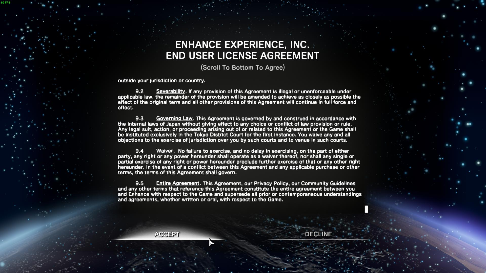

# 开启中文选项说明 

1. 点击OPTION（设置）
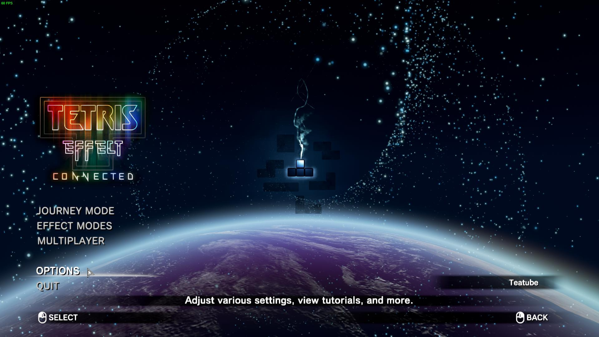

2. 选择GAMEPLAY
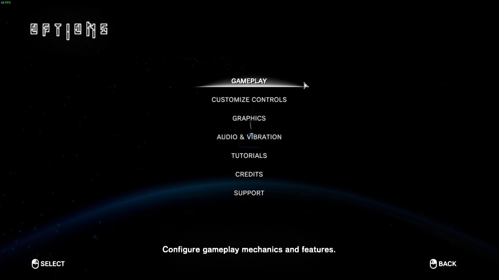

3. 鼠标滚轮找到下方 language，选择Simplified Chinese
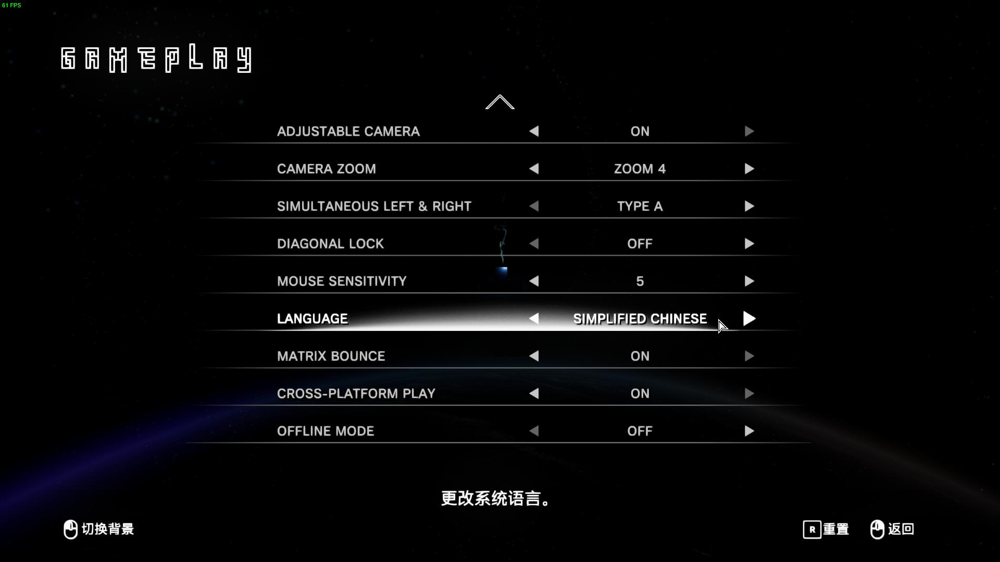

# GAMEPLAY ：设置游玩方式和功能选项 

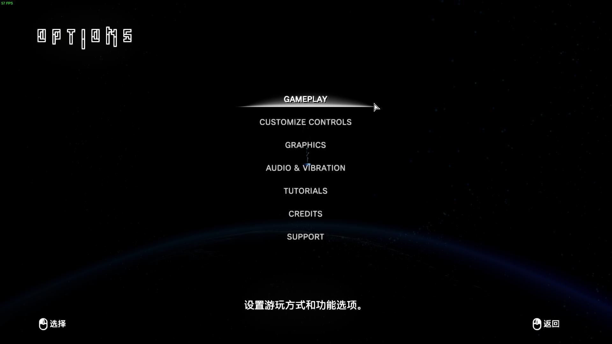

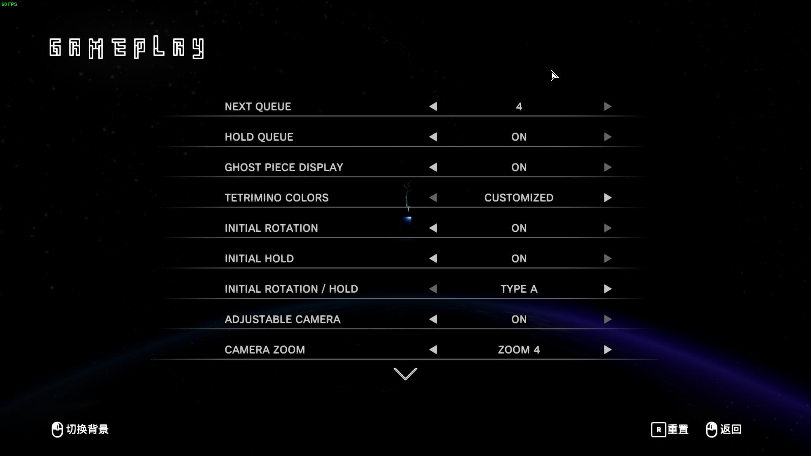

NEXT QUEUE：Next个数（0-4）**推荐 4**
HOLD QUEUE：HOLD开关 
GHOST PIECE DISPLAY：方块投影开关
TETRIMINO COLORS：方块颜色
* CUSTOMIZED：随关卡变化（大部分为单色）
* TRADITIONAL：使用传统七色配色
	+ 推荐单人用CUSTOMIZED，多人用TRADITIONAL
ITITIAL ROTATION： 预先旋转，在方块出现前旋转，让方块以旋转后的姿态出现 **推荐开启**
INITIAL HOLD：预先HOLD，在方块出现前HOLD，让出现的方块直接为HOLD后的方块 **推荐开启**
INITIAL ROTATION/HOLD：预先操作类型选择
* TYPE A：出现瞬间按住才有效
* TYPE B：下一个方块出现前，按新的才会有效
ADJUSTABLE CAMERA：可调动视角
CAMARA ZOOM：调整视角前后远近（默认ZOOM 4，最大ZOOM 10）**如果嫌场地小可以用此调大**

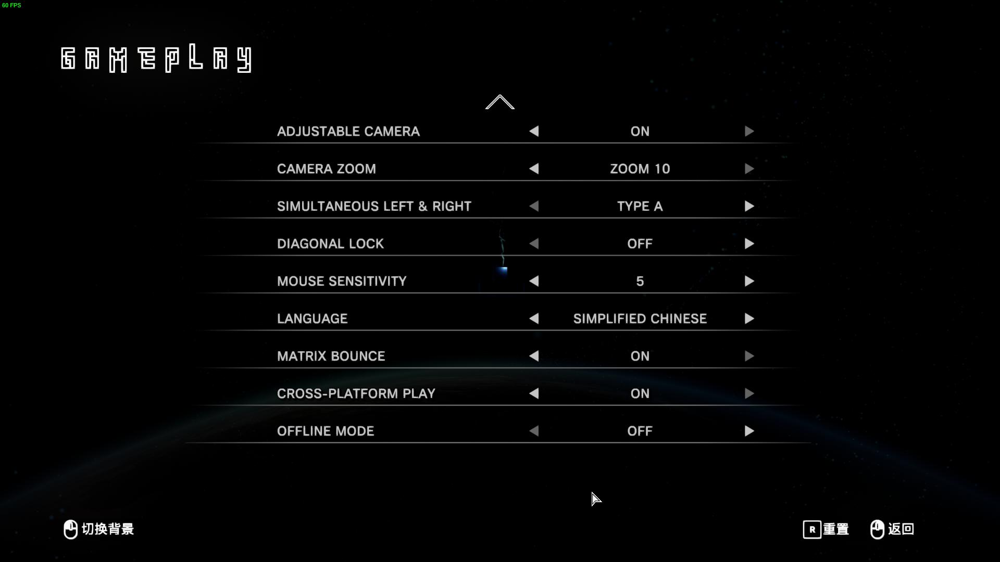

DIAGONAL LOCK：手柄操作时，按住左右移动时是否禁止降落
MOUSE SENSITIVITY：鼠标操作灵敏度（默认5）
LANGUAGE：语言（中文选SIMPLIFIED CHINESE）
MATRIX BOUNCE：场地晃动开关
CROSS-PLATFORM PLAY：跨平台游戏开关
OFFLINE MODE：离线模式开关

# CUSTOMIZE CONTROLS 自定义按键控制

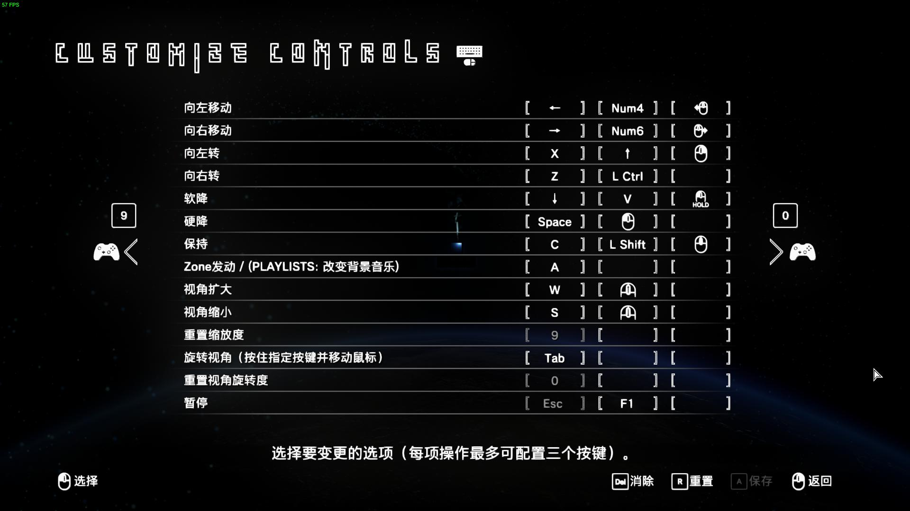

~~需要注意的是：这里的左转右转实际是反的~~ 
汇报问题后已修复，现在【向右转】在上方，【向左转】在下方
键盘按A键，或鼠标点击右下角[A]保存，来保存

效应支持使用鼠标操控，并且支持识别以下按键：
* 鼠标左键
* 鼠标左键（按住）
* 鼠标右键
* 鼠标右键（按住）
* 鼠标中键（滚轮按下）
* 鼠标滚轮上滚动
* 鼠标滚轮下滚动
* 鼠标左移动
* 鼠标右移动
* 鼠标侧键（两个都可以）

反正比PPT的鼠标高了不知道多个数量级（

你也可以左手按住“旋转视角键”（默认TAB），然后配合纯鼠标操控，感受不一样的乐趣。

手柄：
因为大同小异，就不做过多赘述了

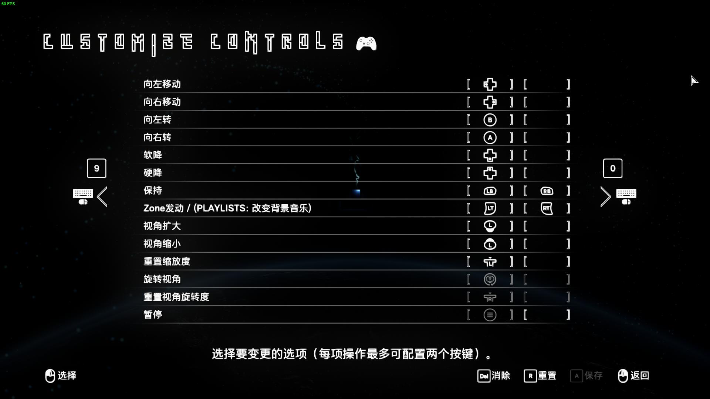

# GRAPHICS 画质选项

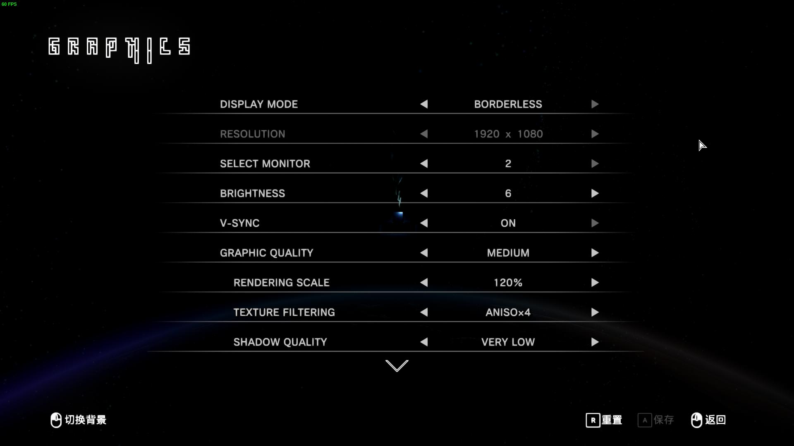

因具体和方块本身基本没有关系，所以大多数选项都可以看中文选项说明。

HUD：抬头显示器（指各种游戏数据（等级、消行等））
可以设置为只留ZONE或者什么都不留（方便录像纯享）

# AUDIO & VIBRATION 音频和震动

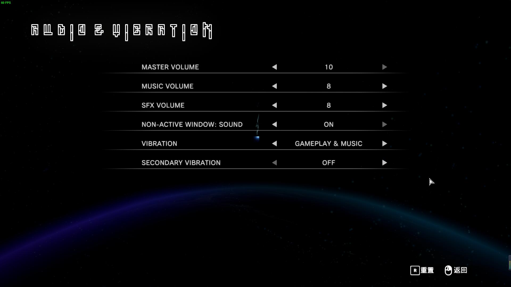

因具体和方块本身基本没有关系，所以大多数选项都可以看中文选项说明。

# 多人相关

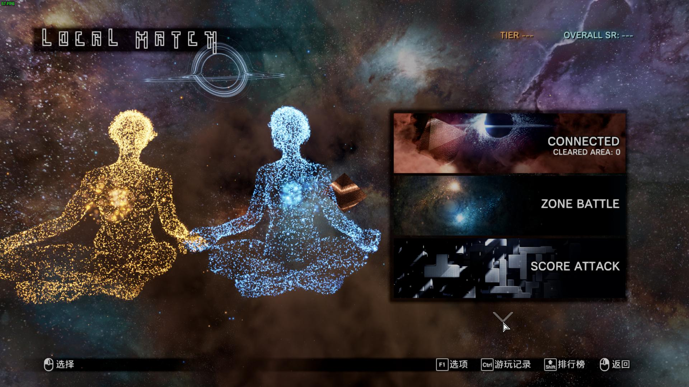

这里能往下。

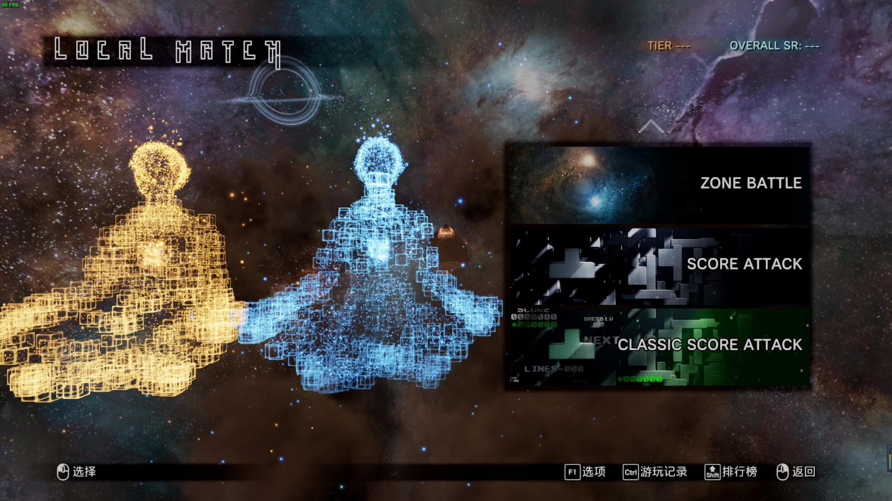

在此画面中，可以按Ctrl设置比赛具体规则，或按Shift进行玩家设置。

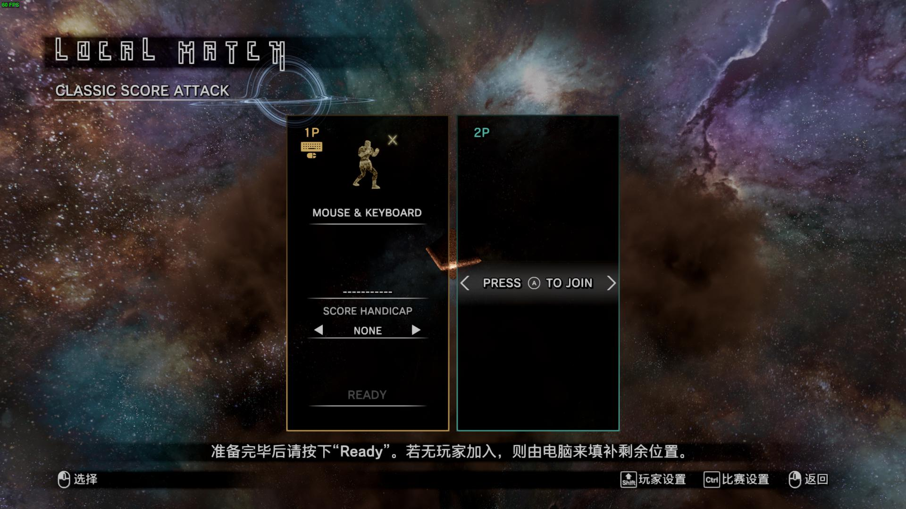

Steam版 在第一次打开多人模式时会自动复制设置好的键位给本地多人，但之后的本地多人模式键位不再跟随单人设置。