# Tetris Online Study

简介
-----
**Tetris Online Japan 研究(Study)群 私用服务器**
俗称「茶服」。起名是因为目前挂在茶管的服务器上。也有「国服」的说法。
目前只是测试阶段，~~并且挂在了一个玩具服务器上……（真的没问题吗！）~~
不过由于TOP的服务器在波兰，延迟实在是高，导致许多国内玩家体验不佳……

……于是就诞生了此「方块线上研究用服务器」

<a class="btn btn-primary" href="https://jq.qq.com/?_wv=1027&k=5IVthgr" role="button">加入俄罗斯方块·[研◇究] 一起私服约战 &raquo;</a>

<a class="btn btn-primary" href="https://jq.qq.com/?_wv=1027&k=5Zc4mp7" role="button">加入俄罗斯方块·[探🔍索] 一起私服约战 &raquo;</a>

2020的支援资金
------
编号|昵称|合计|微信|QQ钱包|支付宝
--:|:--|--:|--:|--:|--:
T196|蕴空之灵|39.2|19.6|19.6|	
T655|ThTsOd|22.22|22.22||		
T1976|明石|20||20|	
T3521|孤城|20|20||		
T5488|玄天明空|20|20||		
T6696|Sasoric|20|20||		
T7023|miya|20||20|	
T未知|W**E|15|15||		
T127|gggf (kissne)|7.33|7.33||		
T043|xb|7.01|7.01||		
T1385|怀沙|5|||5
T2010|hahg|5|5||		
T626|MrZ|2.6|2.6||		
T2624|zx|2.5||2.5|	
T391|T-spin|1.6|1.6||		
T895|ThetaOmega|1.6|1.6||		
T167|Fireboos|1||1	
|合计|210.06|141.96|63.1|5

**茶茶在此感谢大家对茶服的支持~！也请各位好好的享受茶服哦~！**

下载地址
------

请加入<a href="https://jq.qq.com/?_wv=1027&k=5IVthgr">**俄罗斯方块·[研◇究]群**</a>或<a href="https://jq.qq.com/?_wv=1027&k=5Zc4mp7">**俄罗斯方块·[探🔭索]群**</a>，
你可以在群文件的**【茶服相关】Tetris Online Study **文件夹中找到:

+ 【茶服完整包】TO-P_CHS_05.zip
+ 【茶服启动包】解压到TOP目录下即用.zip

如果你已经下载过 TOJ 或 TOP，则只需要下载【茶服启动包】，并将其覆盖到 TOJ 或 TOP 根目录。
如果你没有下载过TOJ或TOP，则需要下载【茶服完整包】。

注册账号
-------
**2020年5月7日之前的账户已全部清除，请重新按照下方提示注册**

在存在「0x16」/ T035.MYS(bot) (tea-cloud@qq.com); 的群内找到她，
**添加其为好友（不然可能收不到消息）**，私聊回复
「**茶服激活username**」**千万注意中间不留空格**。
**将username换为你想注册的id名称**（如：茶服激活teatube）
即可获得id和登录密码。

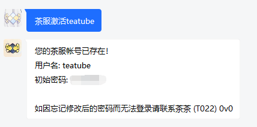

如果忘记初始密码，直接再私聊小转「茶服激活username」即可再次获取初始密码。
由于随时可以获取，所以**不建议**更改密码，
如果一定要更改，请在游戏房间内，聊天框中输入指令
/password_change old new
old为旧密码，new为新密码。
建议建立加密私房进行此操作，防止不必要的密码泄露。

**更改后如果忘记密码的话**，如果茶茶有时间可以帮弄一下，**没有的话就只能退群销号重新来过了**……

关于新TOJ启动器
-----------
旧（中文）启动器于2012年前后，由群主 farter（屁）所制作。
新启动器于2018年，由 T754 (已车二) 制作。

在原来的启动器基础上，增加了以下功能：

+ 分服务器保存密码、账户
+ 增加消行延迟、next数目调整
+ 改善UI，看起来更舒服一些
+ 整合了 SjeJhh 拆包打包工具

<a class="btn btn-info" href="https://github.com/BSoD-Ultimate/TOPLauncher" role="button"> GitHub项目地址</a>

## 使用方法 ※使用新启动器必读※ ##
1.**下载完整合包**、或**下载补丁包并已经覆盖**到TOP根目录后，将tetris.exe和TOPLauncher.exe都设置为【**以管理员模式运行此程序**】

具体操作：右键——属性——兼容性选项卡——以管理员身份运行此程序

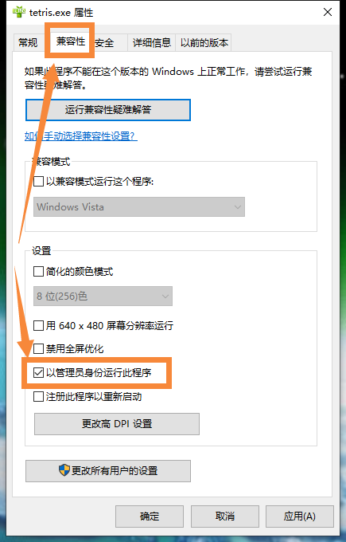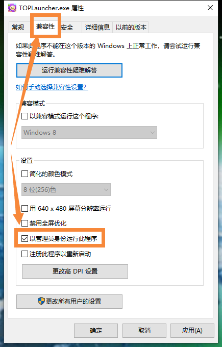

2.打开【**TOPLauncher.exe**】（如果打开启动器报错则你需要安装C++运行库）

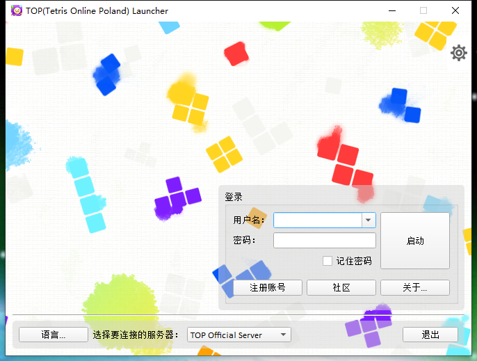

3.此时点击【注册按钮】则会跳转到TOP的官网上注册，我们现在着手添加Tetris Online (Study)。

点击左下角的设置按钮

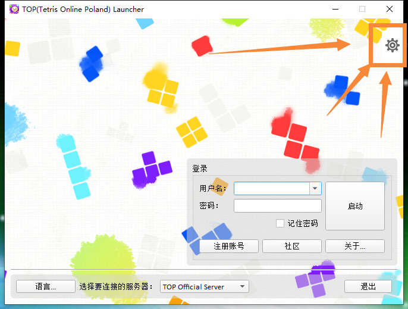

打开设置界面后，请将以下内容按照下图的位置填入，并点击【保存更改】。

```
Tetris Online (Study)
teatube.ltd
http://teatube.ltd/tos/ 
```

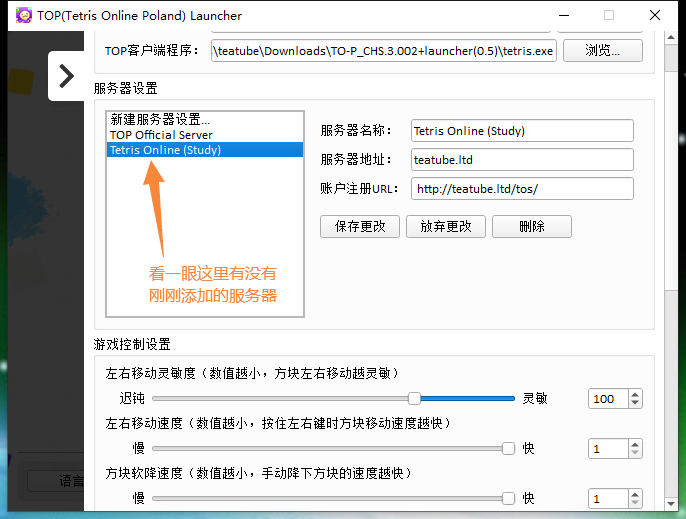


保存更改后应该如下图：

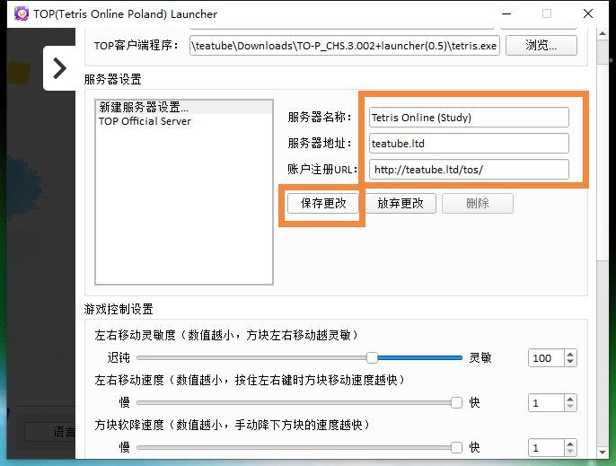

此时可以点掉设置的×，不过建议先调整下方游戏控制参数。
将滑条往下拉即可以设置。

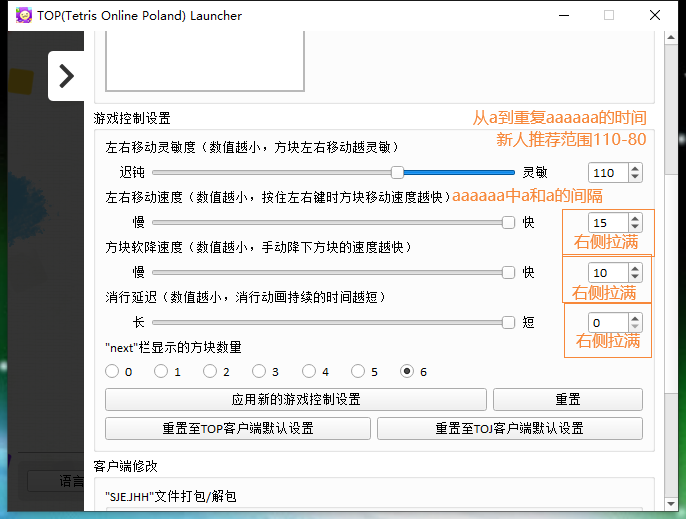

其中，【消行延迟】为**本启动器专有选项**，可以减小到0。

4.保存设置后，点右上角的 X ，回到主界面后，选择下方服务器为
Tetris Online (Study)（或你自定义的名称）。

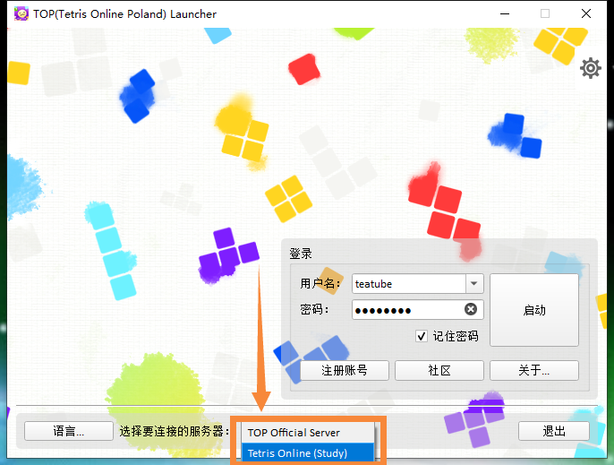

然后到存在「0x16」/ T035.MYS(bot) 的群内找到她，加为好友，私聊回复「茶服激活id名称」
**千万注意中间不留空格**（如：茶服激活teatube）即可获得id和登录密码。


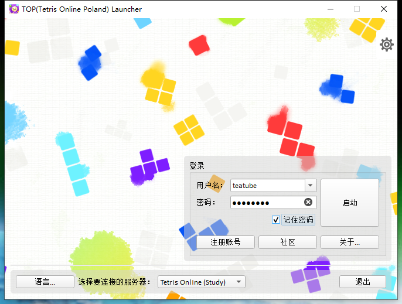

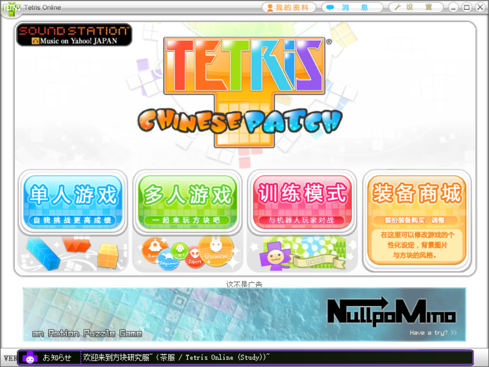

成功登录~

## 旧版启动器添加方法 ##

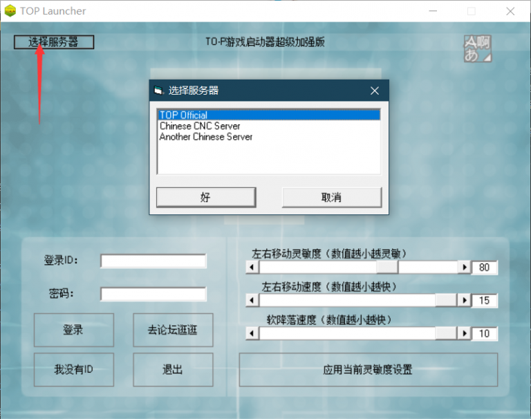

图片当中的选择服务器没有茶服，需要手动按照如下步骤添加：

1.找到 launcher 文件夹下的servers.txt文件

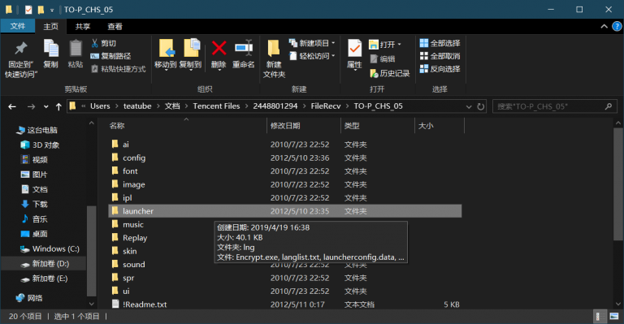

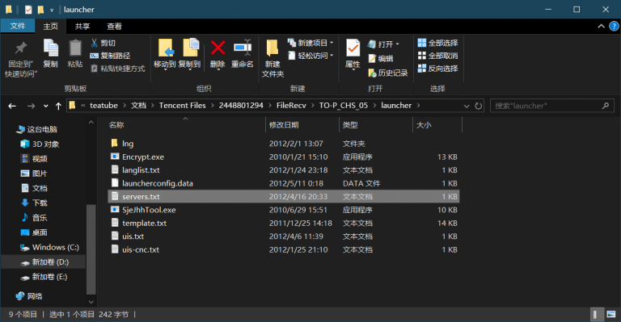

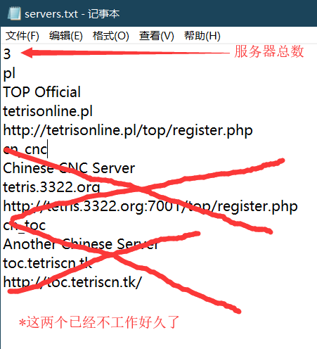

可以把servers.txt的更换为以下内容：

```
2
pl
TOP Official
tetrisonline.pl
http://tetrisonline.pl/top/register.php
TOS
Tetris Online (Study)
teatube.ltd
http://teatube.ltd/tos/
```
保存后，重启Launcher就会有Tetris Online (Study) 啦~

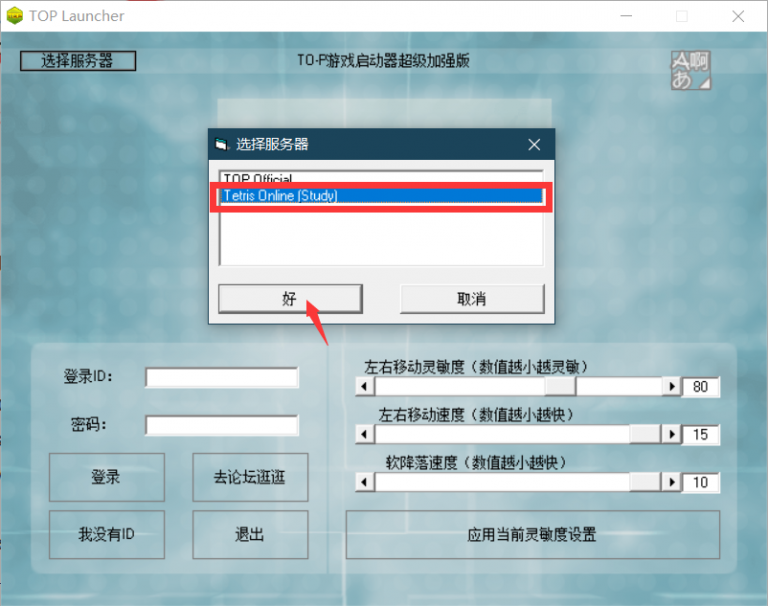

常用命令合集
-----------
`/setting (/s)`查看房间设置

`/garbage (/g) [类型]`垃圾行种类更改
支持以下种类：
`[toj]` 默认
`[huopin]` 火拼交错垃圾行
`[wide [x]]` 指定宽度
`[air]` 空气垃圾行
`[one]` 固定位置一长洞
`[zigzag [x]]`Z拐弯型（x宽）
`[long [x]]`
`[tspin]`可T-spin型垃圾行
`[tetro]`
`[messy [x]]`
`[1234]`
`[4321]`

注：以上垃圾行种类只能在TOS内使用。TOP内只能用`/huopin [on/off]`
（在房间内输入`/g`可以查看种类）

`/hurryup [数字]`实心行开始增长时间（秒）。0为不启用。

`/score `分数相关
`/score reset`重置当前房间自己分数（下一局结算时生效）（如下一局获胜则下方显示胜场1，否则为0）（2019/7/16追加）

`/reset_stats [password]`重置个人数据
`/password_change [old] [new]`更改个人密码

### 多人房 ###
`/ai [1-36]` 多人房 AI等级调整
`/rated [on/off]` 道具频道分数开关

### 单挑房 ###
`/spec`移动到观战席
`/play`加入到游戏席
`/rated [on/off]` 段位分数变动开关

### 管理用 ###
`/announce` 
`/motd`
`/remove_score [mode] [name] [type]`
`/ban`

Staff
------
T008.wojtek（TOP服主）
TTTT.屁（服务端源码/魔改提供/旧版启动器）
T022.Teatube (服务器提供、日常管理)（茶乃叶）
T655.ThTsOd（服务器源码/魔改实现）（zxc）
T665.Tinko（前端/注册系统）
T754.已车二（新版启动器）
T3055.ditoly（启动器日文化）

## 特别感谢

犬山玉姬老师（犬山たまき先生）（vtb憋〇方块风发起人）@犬山玉姬Official
神乐魅娅小姐（神楽めあさん）（她改变了冲国方块）@神楽Mea_Official
凑阿库娅女士（湊あくあさん）（咩啊最好的挚友）@湊-阿库娅Official

T7023.miya （现研究群群头像，第一个正式加入方块群的虚拟方块人猫）@喵田弥夜Miya
T5901.奈莯naki （可爱又努力的方块上瘾幽灵）@安樱奈莯Naki
J4649.（狼哥今天挖掘极难过了吗）@呜米

前来游玩茶服的你们
因为vtb而对方块感兴趣的单推/DD们

还有，喜欢方块的你w

